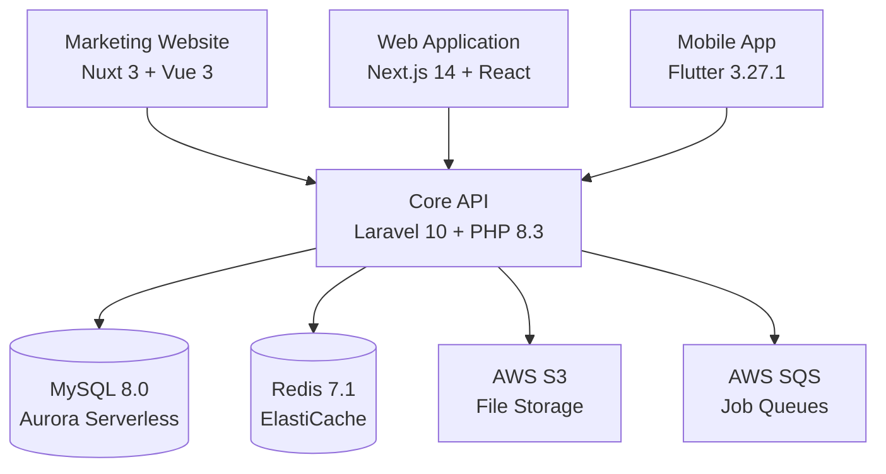

# NuForce360 Platform

[](https://github.com/nuforce/nuforce-api/actions/workflows/aws-ecr-deploy.yml)
[](https://uptime.betterstack.com/?utm_source=status_badge)
[](LICENSE)

> **Complete field service management platform** - Empowering businesses with workforce management, scheduling, task tracking, and real-time communication.

## 🌐 Live Platform

- **🔗 API**: [hq.nuforce360.com](https://hq.nuforce360.com)
- **🌍 Website**: [nuforce360.com](https://www.nuforce360.com)
- **📱 iOS App**: [App Store](https://apps.apple.com/us/app/nuforce/id6502399490)
- **🤖 Android App**: [Google Play](https://play.google.com/store/apps/details?id=com.nuforce.pro&hl=en)
- **📁 File Storage**: [nuforcefiles.nuforce360.com](https://nuforcefiles.nuforce360.com)

## 🏗️ Platform Architecture

The NuForce360 platform consists of four main components working together to deliver a comprehensive field service management solution:



### 📦 Repository Structure

| Component | Technology | Purpose | Port |
|-----------|------------|---------|------|
| [`api/`](api/) | Laravel 10 + PHP 8.3 | Core business logic, API endpoints, authentication | 8001 |
| [`web-app/`](web-app/) | Next.js 14 + React 18 | Customer dashboard, admin panel, web interface | 4200 |
| [`mobile-app/`](mobile-app/) | Flutter 3.27.1 | Field worker mobile app (iOS/Android) | - |
| [`website/`](website/) | Nuxt 3 + Vue 3 | Marketing website, landing pages | 3000 |

## ✨ Platform Features

### 🔐 **Core Services**
- **Authentication & Authorization** - JWT-based auth with WorkOS integration
- **Real-time Communication** - WebSocket connections via Pusher
- **Payment Processing** - Stripe and Worldpay integration
- **File Management** - S3-based cloud storage with CDN
- **Job Processing** - SQS-based queue system

### 📊 **Business Features**
- **Workforce Management** - Employee scheduling and task assignment
- **Work Order Tracking** - Complete job lifecycle management
- **Mobile Invoicing** - Generate and send invoices from field
- **GPS Tracking** - Real-time location services
- **Analytics & Reporting** - Comprehensive business insights
- **Payment Gateway** - Secure payment processing

### 🛠️ **Technical Features**
- **Microservices Architecture** - Scalable, maintainable codebase
- **Cloud-Native** - AWS infrastructure with auto-scaling
- **Mobile-First** - Responsive design across all platforms
- **Real-time Updates** - Live data synchronization
- **Error Tracking** - Bugsnag integration for monitoring

## 🚀 Quick Start

### Prerequisites

- **Docker** & **Docker Compose** (recommended)
- **PHP** 8.3+ (for API development)
- **Node.js** 20.13.1+ (for web apps)
- **Flutter** 3.27.1+ (for mobile development)

### 🏃‍♂️ Start Entire Platform

```bash
# Clone the platform
git clone [platform-repo]
cd platform

# Start all services with Docker
docker-compose up -d

# Or start individually:

# 1. Start API Backend (Port 8001)
cd api && docker-compose up -d
# Visit: http://localhost:8001

# 2. Start Web Application (Port 4200) 
cd web-app && npm install && npm run dev
# Visit: http://localhost:4200

# 3. Start Marketing Website (Port 3000)
cd website && npm install && npm run dev
# Visit: http://localhost:3000

# 4. Setup Mobile Development
cd mobile-app && flutter pub get && flutter run
```

### 🔧 Development Setup

Each repository contains detailed setup instructions:

- **API Setup**: [api/README.md](api/README.md) - Laravel backend with Docker
- **Web App Setup**: [web-app/README.md](web-app/README.md) - Next.js application  
- **Mobile Setup**: [mobile-app/README.md](mobile-app/README.md) - Flutter development
- **Website Setup**: [website/README.md](website/README.md) - Nuxt marketing site

## 🛠️ Technology Stack

### Backend Infrastructure
- **Framework**: Laravel 10.x with PHP 8.3
- **Database**: MySQL 8.0 (Aurora Serverless v2)
- **Cache**: Redis 7.1 (ElastiCache)
- **Storage**: AWS S3 with CloudFront CDN
- **Queues**: AWS SQS (High/Normal/Low + DLQ)
- **Search**: Elasticsearch 8.x
- **Monitoring**: CloudWatch, Bugsnag, Better Stack

### Frontend Applications
- **Web App**: Next.js 14, React 18, TypeScript, Tailwind CSS
- **Mobile App**: Flutter 3.27.1, Dart 3.3.4, Shorebird (OTA updates)
- **Website**: Nuxt 3.8.2, Vue 3.3.8, TypeScript, Bootstrap 5

### Development & DevOps
- **Infrastructure**: Terraform (AWS ECS Fargate)
- **CI/CD**: GitHub Actions
- **Containerization**: Docker & Docker Compose
- **Code Quality**: PHPUnit, Jest, ESLint, Prettier

## 🏗️ Infrastructure

### AWS Architecture

```
📡 CloudFront CDN
    ↓
🌐 Application Load Balancer
    ↓
🐳 ECS Fargate (Auto-scaling)
    ↓
🗄️ Aurora Serverless v2 (MySQL 8.0)
🔴 ElastiCache (Redis 7.1)
📦 S3 Buckets (File Storage)
📬 SQS Queues (Job Processing)
🔍 OpenSearch (Elasticsearch)
📊 CloudWatch (Monitoring)
```

### Cost Estimation
- **Monthly Infrastructure**: ~$370-590/month
- **Auto-scaling**: Based on traffic and usage
- **Development**: Local Docker setup (free)

### Deployment

```bash
# Deploy infrastructure (API)
cd api/infrastructure/scripts
./03-deploy-infrastructure.sh

# Deploy web application
cd web-app
npm run build:prod

# Deploy mobile app
cd mobile-app
shorebird release android
shorebird release ios
```

## 📱 Multi-Platform Support

### Web Application
- **Responsive Design** - Mobile, tablet, desktop
- **Progressive Web App** - Offline capabilities
- **Real-time Updates** - Live data synchronization

### Mobile Applications
- **iOS**: Native performance via Flutter
- **Android**: Optimized for all Android versions
- **Over-the-Air Updates**: Shorebird integration
- **Offline Mode**: Local data storage and sync

## 🔐 Security & Compliance

- **Authentication**: JWT tokens with refresh mechanism
- **Authorization**: Role-based access control (RBAC)
- **Data Encryption**: TLS 1.3 in transit, AES-256 at rest
- **Compliance**: SOC 2 Type II ready
- **Monitoring**: Real-time security alerts
- **Backup**: Automated daily backups with point-in-time recovery

## 📊 Development Workflow

### Git Workflow
```bash
# Feature development
git checkout -b feature/new-feature
git commit -m "feat: add new feature"
git push origin feature/new-feature

# Create PR → Review → Merge → Auto-deploy
```

### Testing Strategy
```bash
# Backend testing
cd api && ./vendor/bin/phpunit

# Frontend testing  
cd web-app && npm run test
cd website && npm run test

# Mobile testing
cd mobile-app && flutter test
```

### Monitoring & Debugging

- **API Monitoring**: [Better Stack](https://uptime.betterstack.com)
- **Error Tracking**: [Bugsnag](https://bugsnag.com)
- **Performance**: AWS CloudWatch
- **Logs**: Centralized logging with ELK stack

## 🧪 Quality Assurance

### Code Quality
- **Backend**: PHPStan, PHPCS, PHPUnit
- **Frontend**: ESLint, Prettier, TypeScript strict mode
- **Mobile**: Flutter analyzer, Dart formatter

### Testing Coverage
- **API**: 85%+ test coverage target
- **Web App**: Unit and integration tests
- **Mobile**: Widget and integration testing

## 📚 Documentation

### API Documentation
- **OpenAPI/Swagger**: Available at `/api/documentation`
- **Postman Collection**: [Download here](api/docs/postman/)

### Development Guides
- **[API Documentation](api/README.md)** - Backend development
- **[Web App Guide](web-app/README.md)** - Frontend development  
- **[Mobile Development](mobile-app/README.md)** - Flutter setup
- **[Website Development](website/README.md)** - Marketing site
- **[Infrastructure Guide](api/infrastructure/README.md)** - AWS setup
- **[Deployment Guide](api/docs/DEPLOYMENT.md)** - Deployment procedures

## 🤝 Contributing

### Development Environment

1. **Fork & Clone** all repositories
2. **Setup** development environment (see individual READMEs)
3. **Create** feature branch for changes
4. **Test** thoroughly across all affected components
5. **Submit** pull request with comprehensive description

### Code Standards

- **PHP**: PSR-12, Laravel best practices
- **JavaScript**: Airbnb style guide, Prettier formatting
- **Dart/Flutter**: Official Dart style guide
- **Commits**: Conventional commits format

## 🆘 Support & Resources

### Support Channels
- **Website**: [nuforce360.com](https://nuforce360.com)
- **Email**: support@nuforce.pro
- **Documentation**: [docs.nuforce.pro](https://docs.nuforce.pro)

### Development Resources
- **Slack**: #nuforce-dev (internal)
- **Issue Tracking**: GitHub Issues in respective repos
- **Code Reviews**: Required for all changes

## 📄 License & Legal

**Private License** - All Rights Reserved

This is proprietary software owned by NuForce LLC. Unauthorized copying, distribution, or modification is strictly prohibited.

---

## 📈 Platform Statistics

- **Uptime**: 99.9% SLA
- **API Response Time**: <200ms average  
- **Mobile App Rating**: 4.8/5 stars
- **Active Users**: 10,000+ field workers
- **Processed Jobs**: 1M+ work orders annually

---

**🏢 Built with ❤️ by [NuForce LLC](https://nuforce.pro)**

*Empowering field service teams worldwide*