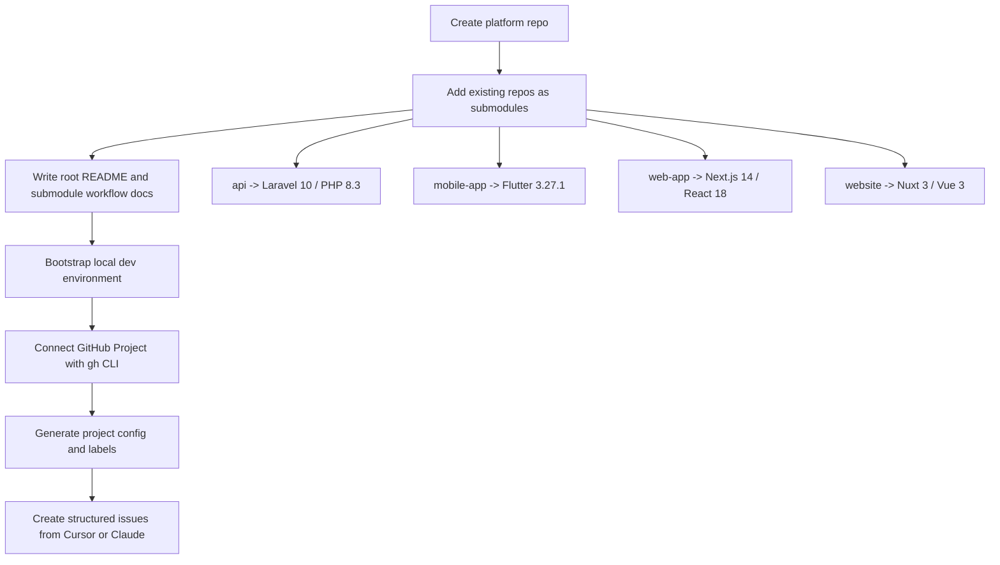

*Author: Imran. I build projects using AI tools and automate the developer environment for maximum productivity.*

When a product spans multiple repositories, the setup problem is usually not "how do I run `git clone` four times." The problem is keeping developer onboarding, local environment startup, repository coordination, and project management in sync without turning the root repo into a pile of copy-pasted instructions.

This article shows how I set up a platform repository as a control plane around four existing repositories:

- `api`
- `mobile-app`
- `web-app`
- `website`

I also explain what I learned from using Cursor/Claude skills from [aicoach.pw](https://aicoach.pw), especially where a skill is useful and where you still need precise repository-specific instructions.

## The Problem

This is not a monorepo. It is a product made of multiple deployable codebases:

- `api/` is Laravel 10 + PHP 8.3
- `mobile-app/` is Flutter 3.27.1
- `web-app/` is Next.js 14 + React 18
- `website/` is Nuxt 3 + Vue 3

Each repo has its own build toolchain, runtime assumptions, and deployment path. The platform repo should not duplicate those codebases. It should:

- pin compatible commits across repos
- document the real local setup
- give developers one place to start
- connect delivery work to GitHub Projects

That is why I used a root platform repo with git submodules instead of trying to flatten everything into one repository.

## Final Topology



> Image placement: a Cursor sidebar screenshot showing the root platform repo with `api`, `mobile-app`, `web-app`, and `website` expanded as submodules. This helps readers see that the root repo is a control plane, not a merged source tree.

## Step 1: Create the Platform Control Plane

I started with a root repository that would hold:

- `.gitmodules`
- a platform-level `README.md`
- a submodule workflow guide
- GitHub Project configuration in `.github/project-config.json`

The initial root repo creation was straightforward:

```bash
git init
gh repo create <org>/project-platform \
  --description "Platform control plane for a multi-repository product" \
  --public
git remote add origin https://github.com/<org>/project-platform.git
```

The important decision here is conceptual: the root repo is not the place where application code converges. It is where operational metadata converges.

That distinction matters later when you automate issue creation, sprint planning, or onboarding docs.

## Step 2: Add the Existing Repositories as Submodules

The current `.gitmodules` file pins the external repositories explicitly:

```ini
[submodule "api"]
	path = api
	url = https://github.com/<org>/api.git
[submodule "mobile-app"]
	path = mobile-app
	url = https://github.com/<org>/mobile-app.git
[submodule "web-app"]
	path = web-app
	url = https://github.com/<org>/web-app.git
[submodule "website"]
	path = website
	url = https://github.com/<org>/website.git
```

The commands were:

```bash
git submodule add https://github.com/<org>/api.git api
git submodule add https://github.com/<org>/mobile-app.git mobile-app
git submodule add https://github.com/<org>/web-app.git web-app
git submodule add https://github.com/<org>/website.git website

git submodule init
git submodule update --recursive
```

For new developers, the bootstrap path is:

```bash
git clone --recursive https://github.com/<org>/project-platform.git
cd project-platform

# If someone cloned without --recursive:
git submodule init
git submodule update --recursive
```

### Why submodules and not a monorepo import?

Because the four repos already exist independently:

- they have their own branch strategies
- they have their own CI/CD
- they can be deployed separately
- they should remain independently reviewable

Submodules let the platform repo declare a tested cross-repo state without rewriting repository ownership.

### One technical detail that trips teams up

Submodules point to commits, not branches.

That means this:

```bash
git submodule update
```

can leave you in detached HEAD state inside a submodule. If you want to work inside a submodule, you need to check out a branch explicitly:

```bash
cd api
git checkout main
# or your feature branch
```

I documented that in `SUBMODULES.md` because this is one of those problems that wastes time every time a new developer hits it.

> Image placement: a terminal screenshot showing `git submodule status` output and one submodule checked out to a pinned commit. This is useful because detached HEAD is easier to explain visually than verbally.

## Step 3: Write the Root-Level Setup Around Real Commands

The root repo should not invent setup commands. It should aggregate what each repo actually requires.

That meant reading the existing docs and package manifests, then normalizing the entry points.

### API setup

The API repo is Laravel 10 on PHP 8.3 with MySQL, Redis, SQS, S3, and Docker-based local services.

The current setup path is:

```bash
cd api
composer install
npm install
docker-compose up -d

# Optional: watch DB initialization
docker-compose logs -f mysql
# Wait for: "Database initialization complete! Tables: 59"
```

The API README also exposes an alternate development setup:

```bash
docker-compose -f docker-compose-development.yml up -d
```

and a service management script:

```bash
./scripts/services.sh start
./scripts/services.sh status
./scripts/services.sh logs mysql
```

That is a good example of where the platform repo should link to subrepo docs rather than hide complexity.

### Web app setup

The web app repo is Next.js 14.2.4 and explicitly runs on port `4200`:

```bash
cd web-app
npm install
npm run dev
```

The scripts are:

```json
{
  "dev": "next dev -p 4200",
  "build": "next build",
  "build:prod": "dotenv -e .env.prod -- next build",
  "lint": "next lint",
  "test": "jest"
}
```

That port detail matters. If you skip it in the root docs, developers assume default Next.js behavior on `3000` and then conflict with the website repo.

### Website setup

The website repo is Nuxt 3.8.2 and intentionally uses `3000`:

```bash
cd website
npm install
npm run dev
```

It also supports:

```bash
npm run build
npm run generate
npm run preview
```

This separation is useful:

- `web-app` is the authenticated product UI on `4200`
- `website` is the public marketing site on `3000`

### Mobile app setup

The mobile app repo is Flutter 3.27.1 with Dart 3.3.4. The README also pins supporting toolchain details:

- Java 17.0.9
- Kotlin 1.9.23
- Xcode 15.0.1

Local setup starts with:

```bash
cd mobile-app
flutter pub get
flutter run
```

Release and patch workflows use Shorebird:

```bash
shorebird release android
shorebird release ios
shorebird patch --platforms=android
shorebird patch --platforms=ios
```

### The real startup order

I recommend developers bring up the system in this order:

```bash
# 1. Clone and hydrate submodules
git clone --recursive https://github.com/<org>/project-platform.git
cd project-platform

# 2. Start backend dependencies first
cd api
composer install
npm install
docker-compose up -d
cd ..

# 3. Start the web app
cd web-app
npm install
npm run dev
cd ..

# 4. Start the marketing site
cd website
npm install
npm run dev
cd ..

# 5. Start mobile when needed
cd mobile-app
flutter pub get
flutter run
```

The root `README.md` is valuable only if it reflects this exact startup choreography.

## Step 4: Treat Documentation as an Operational Surface

I added two root documents:

- `README.md` for platform-level setup and topology
- `SUBMODULES.md` for daily Git workflows

This is not just documentation hygiene. It changes how the repo is used:

- the platform `README.md` answers "how do I run the system?"
- `SUBMODULES.md` answers "how do I work across repos without creating git confusion?"

The second document is the one most teams forget.

A useful example from `SUBMODULES.md` is the cross-repo workflow:

```bash
# Create the platform branch
git checkout -b platform/user-authentication

# Create matching feature branches in submodules
cd api && git checkout -b feature/auth-endpoints
cd ../web-app && git checkout -b feature/auth-ui
cd ..
```

That is the kind of workflow developers actually need when a feature spans API plus UI.

> Image placement: a split screenshot with the root `README.md` on one side and `SUBMODULES.md` on the other, showing the distinction between environment setup and git workflow guidance.

## Step 5: Connect the Platform Repo to GitHub Projects v2

Once the repo exists, you still need a delivery layer. In this case, that is the GitHub Project board at:

`https://github.com/orgs/<org>/projects/8`

Before touching the project board, I checked GitHub CLI auth and project scope:

```bash
gh auth status
```

Then I pulled the project metadata:

```bash
gh project view 8 --owner <org> --format json
gh project field-list 8 --owner <org> --format json
```

This step is non-negotiable.

If you automate GitHub Projects, you need the real field IDs and option IDs, not guessed names. For example, the current project state includes:

- `Status`
  - `Backlog` -> `3cf2289c`
  - `Ready` -> `c941efbe`
  - `In Progress` -> `7a8689b6`
  - `In Review` -> `78a83e7e`
  - `Done` -> `7ea7ff86`
- `Priority`
  - `P0` -> `16595e3e`
  - `P1` -> `e6510dc8`
  - `P2` -> `b292f156`
- `Size`
  - `XS` -> `a0869a30`
  - `S` -> `4579bb14`
  - `M` -> `81005245`
  - `L` -> `4be14f95`
  - `XL` -> `080a7abb`

I stored those in `.github/project-config.json` so the repo contains its own automation contract.

Here is a reduced version of that file:

```json
{
  "owner": "<org>",
  "repositories": [
    { "name": "project-platform", "label": "repo:platform" },
    { "name": "api", "label": "repo:api" },
    { "name": "mobile-app", "label": "repo:mobile" },
    { "name": "web-app", "label": "repo:webapp" },
    { "name": "website", "label": "repo:website" }
  ],
  "project": {
    "number": 8,
    "id": "PVT_kwDOA9q8vs4BQfru",
    "title": "project"
  },
  "fields": {
    "Status": {
      "id": "PVTSSF_lADOA9q8vs4BQfruzg-mN04"
    },
    "Priority": {
      "id": "PVTSSF_lADOA9q8vs4BQfruzg-mOq4"
    },
    "Size": {
      "id": "PVTSSF_lADOA9q8vs4BQfruzg-mOrA"
    }
  }
}
```

This file is more important than the chat log that created it. It is durable, reviewable state.

## Step 6: Bootstrap Labels So Issues Can Be Structured, Not Free-Form

Once the project board was connected, I bootstrapped a label taxonomy that matches both product and repository boundaries.

That includes:

- type labels like `type:task`, `type:feature`, `type:bug`
- repository labels like `repo:api`, `repo:webapp`, `repo:mobile`
- platform domain labels like `domain:platform`, `domain:infra`
- business domain labels like `domain:auth`, `domain:scheduling`, `domain:payments`
- size labels from `size:xs` through `size:xl`

This matters because a project board without a label model becomes a manual spreadsheet.

In practice, the setup was a series of `gh label create --force` calls. Example:

```bash
gh label create "type:task" \
  --description "Implementation work" \
  --color "2DA44E" \
  --force

gh label create "domain:payments" \
  --description "Payment processing and invoicing" \
  --color "8B5CF6" \
  --force

gh label create "repo:webapp" \
  --description "Next.js web app repository" \
  --color "0052CC" \
  --force
```

The technical lesson is simple: labels should encode routing information, not just semantics.

`domain:payments` tells me what the work is about.

`repo:webapp` tells me where that work will probably land.

## Step 7: Test the Project Automation with a Real Issue

I do not consider a project board setup complete until one issue has been created, added to the board, and updated through the board fields.

The test issue I used was:

- `[Task] Verify GitHub project management integration`

Creation command:

```bash
gh issue create --repo <org>/project-platform \
  --title "[Task] Verify GitHub project management integration" \
  --body "$(cat <<'EOF'
> **One-line summary:** Verify that the AI project management system is properly configured and functional

## Description

Test the newly configured GitHub project management integration to ensure all components are working correctly including labels, project board fields, and automation.

## Acceptance Criteria

- [ ] Issue created successfully with proper labels
- [ ] Issue appears on project board in correct status
- [ ] Priority and Size fields are configurable
- [ ] Labels are properly categorized
EOF
)" \
  --label "repo:platform,domain:platform,component:config,type:task,size:xs"
```

Then I added it to the board and set fields explicitly:

```bash
ITEM_ID=$(gh project item-add 8 \
  --owner <org> \
  --url https://github.com/<org>/project-platform/issues/1 \
  --format json | jq -r '.id')

gh project item-edit \
  --project-id PVT_kwDOA9q8vs4BQfru \
  --id "$ITEM_ID" \
  --field-id PVTSSF_lADOA9q8vs4BQfruzg-mN04 \
  --single-select-option-id 7a8689b6

gh project item-edit \
  --project-id PVT_kwDOA9q8vs4BQfru \
  --id "$ITEM_ID" \
  --field-id PVTSSF_lADOA9q8vs4BQfruzg-mOq4 \
  --single-select-option-id b292f156

gh project item-edit \
  --project-id PVT_kwDOA9q8vs4BQfru \
  --id "$ITEM_ID" \
  --field-id PVTSSF_lADOA9q8vs4BQfruzg-mOrA \
  --single-select-option-id a0869a30
```

That one test proves:

- issue creation works
- project item mapping works
- the field IDs are valid
- the label taxonomy is usable

> Image placement: a screenshot of the GitHub Project item card showing the issue with `Status`, `Priority`, and `Size` fields populated. This validates the automation in one frame.

## Where Cursor/Claude Skills from aicoach.pw Helped

The most useful part of the [aicoach.pw](https://aicoach.pw) workflow was not "the model wrote text for me." The useful part was that the skill carried a repeatable operational procedure.

In this setup, the most valuable skill pattern was:

- discover real GitHub Project fields
- bootstrap labels with consistent naming
- persist the result as `.github/project-config.json`
- use the same configuration for later issue creation and board updates

That is why the `github-project-manager` skill worked well here.

The prompt was short:

```text
/github-project-manager connect project https://github.com/orgs/<org>/projects/8
```

But the output was structured:

- repository context
- project metadata
- field mappings
- labels
- team members
- workflow definitions

The key point is that the skill gave me a reusable control surface, not just a one-time answer.

## What I Learned Using AI Skills in a Real Developer Workflow

### 1. Skills are best when they produce durable files

The most useful output from an AI-assisted setup is not the chat itself.

It is files like:

- `.gitmodules`
- `README.md`
- `SUBMODULES.md`
- `.github/project-config.json`

If a skill cannot leave behind reviewed state in the repo, its value drops quickly after the chat ends.

### 2. AI is good at orchestration, but only if the inputs are real

The platform setup worked because I pulled actual commands from each repo:

- `docker-compose up -d` from the API
- `next dev -p 4200` from the web app
- `nuxt dev` on `3000` from the website
- `flutter pub get` and Shorebird commands from the mobile app

If I had let the assistant infer generic commands, the article and the setup would both drift from reality.

### 3. GitHub Projects automation requires exact field discovery

Humans talk about "move this to In Progress."

The GitHub CLI needs:

- project ID
- item ID
- field ID
- option ID

That means every serious automation flow should include:

```bash
gh project field-list 8 --owner <org> --format json
```

and should store the result in versioned config.

### 4. A platform repo should aggregate, not absorb

I did not want the root repo to pretend it owned deployment logic from every child repo.

Instead, the root repo now does four things well:

- points to the right submodule commits
- explains how to start the platform locally
- explains how to work with submodules safely
- connects repository work to GitHub Projects

That scope is enough.

### 5. The best AI workflow is "prompt -> repo artifact", not "prompt -> memory"

This is the main lesson I would keep from using Cursor/Claude skills.

The workflow is better when the assistant turns a prompt into one of these:

- a committed config file
- a documented workflow
- a reproducible shell sequence
- a project board update with explicit metadata

That is much more reliable than expecting a future chat session to remember prior setup decisions.

## What I Would Add Next

I would keep the next improvements small and operational:

1. Add a root bootstrap script that checks local prerequisites and prints service health.
2. Add a shared hook distribution strategy for commit hygiene, instead of relying on local `.git/hooks`.
3. Add a root-level `make` or `just` file for common workflows like `bootstrap`, `status`, and `test`.
4. Extend the GitHub Project setup so issues can be created in the most affected child repo and still appear in the same project board.

## Reproducible Checklist

If you want to replicate this setup in another multi-repo product, this is the shortest path I would follow:

```bash
# 1. Create the control-plane repo
git init
gh repo create <org>/<platform-repo>

# 2. Add child repos as submodules
git submodule add <repo-a-url> repo-a
git submodule add <repo-b-url> repo-b
git submodule add <repo-c-url> repo-c
git submodule add <repo-d-url> repo-d
git submodule init
git submodule update --recursive

# 3. Write root docs from actual child-repo commands
#    - README.md
#    - SUBMODULES.md

# 4. Connect GitHub Projects
gh auth status
gh project view <project-number> --owner <org> --format json
gh project field-list <project-number> --owner <org> --format json

# 5. Persist project metadata
#    - .github/project-config.json

# 6. Bootstrap labels
gh label create ... --force

# 7. Create one real issue and verify the full board workflow
gh issue create ...
gh project item-add ...
gh project item-edit ...
```

That is enough to turn a loose collection of repositories into a system that is easier to onboard, easier to coordinate, and easier to operate.

## Closing Notes

The setup here is not complicated because the tools are advanced. It is complicated because every repository has a different runtime and a different failure mode.

The platform repo solved that by becoming a technical index:

- git submodules define what belongs together
- root docs explain how to run it
- GitHub Projects define how work moves
- AI skills reduce the amount of CLI choreography I need to remember

That is the part I would repeat on the next project.

If you are using Cursor or Claude with skills from `aicoach.pw`, my advice is simple: use them to codify repeatable operational flows, not to replace repository truth.
